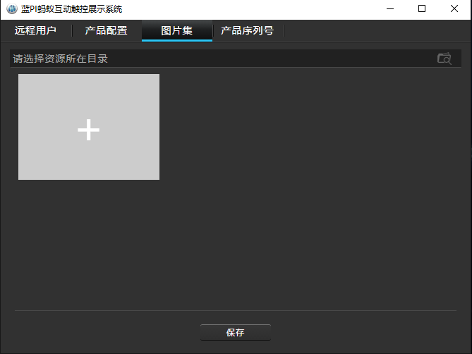
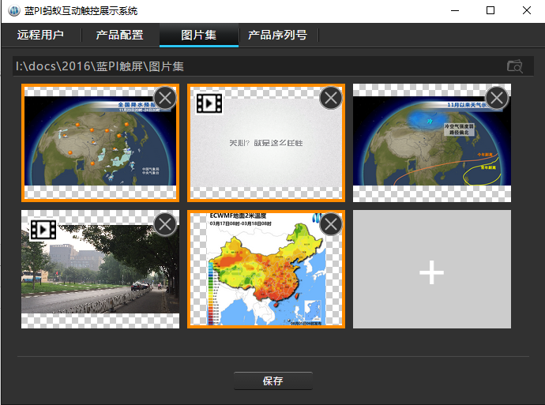

# 导入并使用图片集功能

- pubdate: 2016-11-29
- tags: 蓝PI,蓝PI蚂蚁,触屏,gis,
- navOne: 整体介绍
- navTwo: 图片集

------

### 图片集是为了方便用户通过软件对制作好的图片或视频进行展示的快捷功能。

1. 通过主界面右下角 logo 图片区域的隐式按钮进入管理界面
1. 在管理界面的 “图片集” 选项卡操作界面选择文件夹导入或通过 “+” 号按钮单个资源导入
1. 保存即可在主界面中进行使用

### 操作中常见问题
> 导入的资源默认为使用状态

1）如何切换使用状态？
> 通过点击资源即可方便实现使用状态的切换

2）文件夹中有多余资源怎么办？
> 当通过文件夹导入资源时发现有多余资源，可以有两种方式处理：
> 1. 通过切换资源使用状态（临时不使用）
> 1. 通过资源列表单项右上角的删除按钮（彻底从使用列表中删除，不删除原始文件）

3）资源都支持哪种格式？
> 这里的资源现在可以支持图片和视频两种常见方式：
>
> 图片格式有: `jpg`、`png`、`bmp`、`gif`、`tif`
>
> 视频格式有：`mp4`、`mov`

### 操作界面效果图

